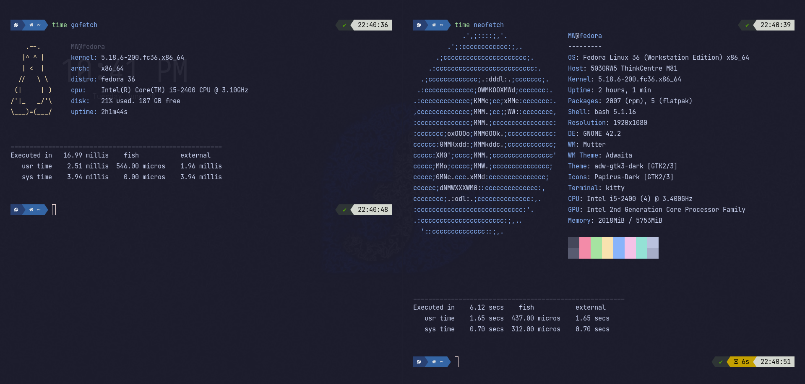

# GOFETCH. A bloat-free, minimal and fast neofetch.
##### A system info fetch utility written in go.

### Install
first add your `GOPATH` to your `PATH` environment variable. Gofetch will be installed in it. Add this to your bashrc/zshrc:
`export PATH=$GOPATH/bin:$PATH`
Then install it with go install:
`go install github.com/mw491/gofetch@latest`

##### gofetch takes 17 milliseconds while neofetch takes SIX SECONDS! (gofetch left, neofetch right)
